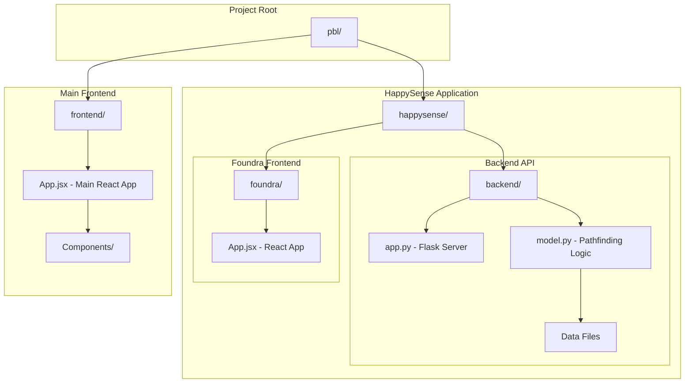
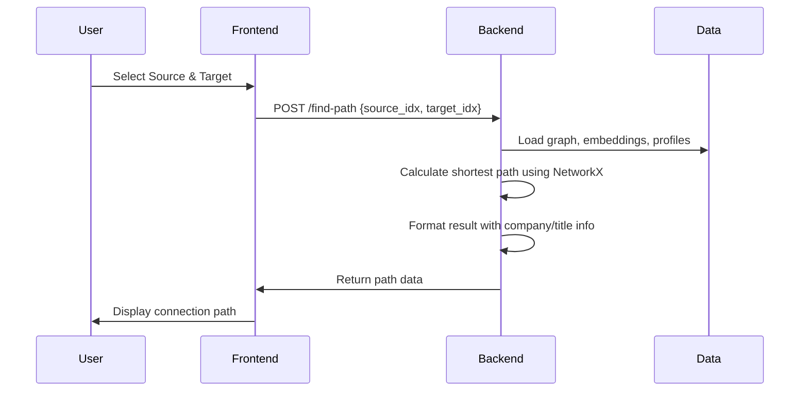
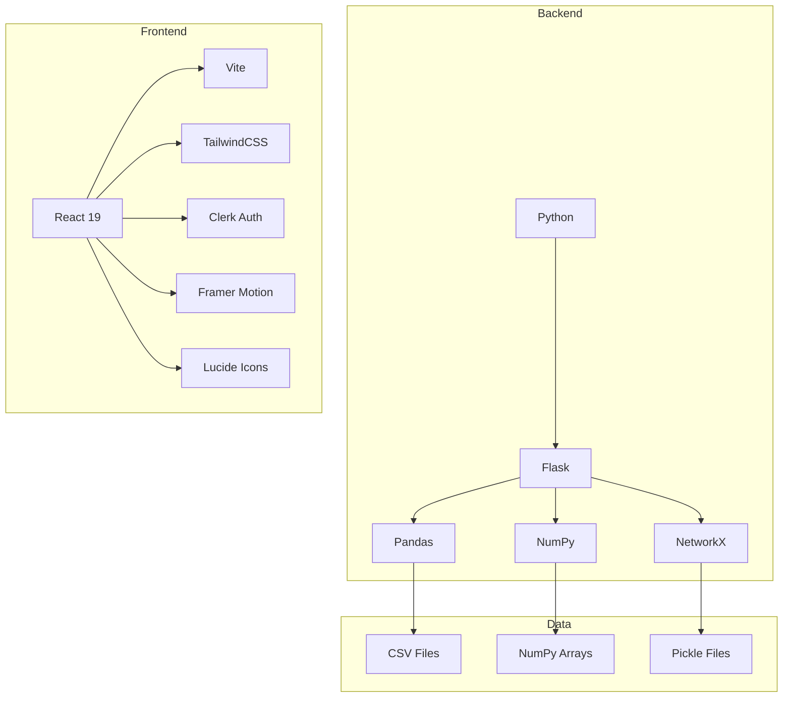
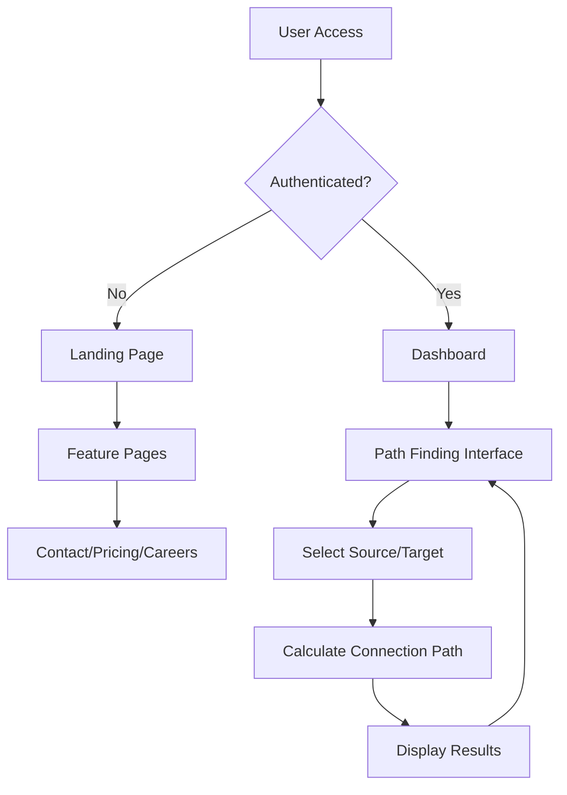
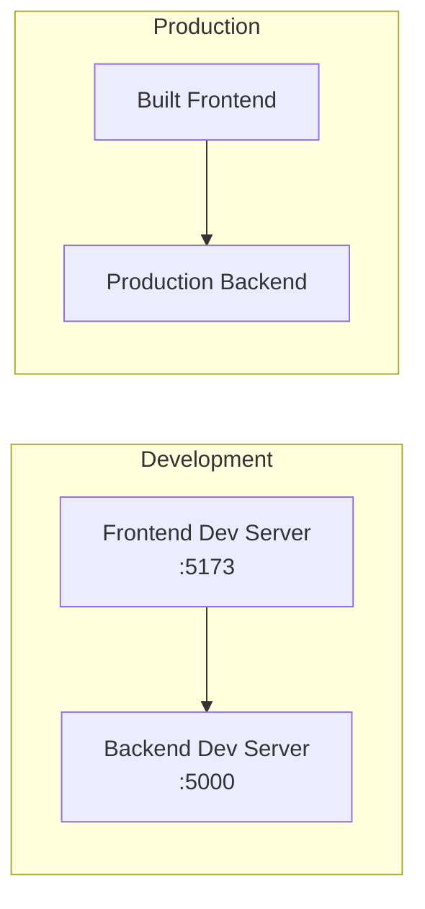

# Project Flowchart Diagram

## Overall Architecture



## Data Flow Architecture

```mermaid
flowchart LR
    subgraph "Data Sources"
        CSV[profiles.csv<br/>Company Profiles]
        NPY[embeddings.npy<br/>Vector Embeddings]
        PKL[graph.pkl<br/>Network Graph]
    end
    
    subgraph "Backend Processing"
        LOAD[load_assets()<br/>Initialize Data]
        FIND[find_path()<br/>Shortest Path Algorithm]
    end
    
    subgraph "API Layer"
        FLASK[Flask App]
        ROUTE[/find-path POST]
    end
    
    subgraph "Frontend Applications"
        HAPPY[HappySense Frontend]
        FOUNDRA[Foundra App]
        MAIN[Main Frontend]
    end
    
    CSV --> LOAD
    NPY --> LOAD
    PKL --> LOAD
    LOAD --> FIND
    FIND --> FLASK
    FLASK --> ROUTE
    ROUTE --> HAPPY
    ROUTE --> FOUNDRA
    ROUTE --> MAIN
```

## Application Flow



## Component Architecture

### HappySense Backend
- **Flask Server** (`app.py`)
  - Health check endpoint: `/`
  - Path finding endpoint: `/find-path` (POST)
- **Pathfinding Engine** (`model.py`)
  - Data loading from files
  - NetworkX shortest path algorithm
  - Result formatting with profile data

### Frontend Applications
1. **Main Frontend** (`frontend/`)
   - React + Vite
   - Clerk authentication
   - Multiple pages (Home, Dashboard, Pricing, etc.)
   - TailwindCSS styling

2. **Foundra** (`happysense/foundra/`)
   - Simple React app
   - Basic Vite setup

## Technology Stack



## Key Features Flow



## Deployment Architecture



This flowchart illustrates a network-based connection finding application with multiple frontend interfaces, a Python Flask backend for pathfinding algorithms, and data storage in various formats (CSV, NumPy arrays, and Pickle files).
